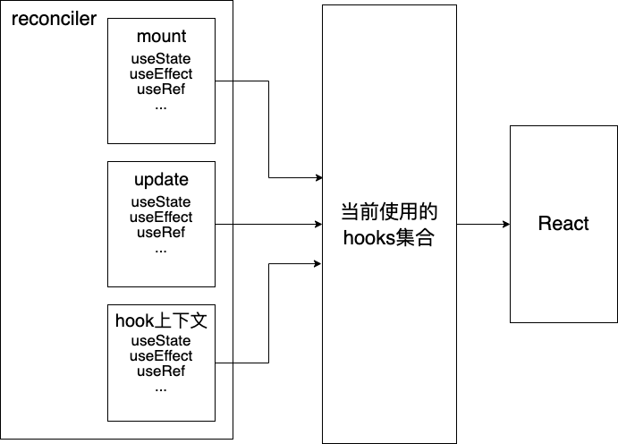

## 更新

更新是从根节点开始
触发更新可以是根节点`createRoot(root).render(<App />)`，也可以是任意组件节点`this.setState; dispatchSetState`，不管从哪里触发更新，都抽象统一到由根节点开始执行更新

## hostRootFiber和fiberRoot

fiber树的结构是由return属性、child属性和sibling属性组成，所以fiberRoot不属于fiber树；

每次fiber树都会从hostRootFiber的构建开始，所以构建过程需要从fiberRoot开始，通过`fiberRoot.current`找到当前hostRoot，新的fiber节点的构建，都是从alternate属性中找到之前的fiber节点，复用该fiber开始构建新的fiber节点。所以`markUpdateFromFiberToRoot`方法要返回fiberRoot；

fiber树根节点hostRootFiber是由root节点(即hostRoot)产生，`hostRootFiber.stateNode`指向fiberRootNode节点，而fiberRootNode节点用于双缓存技术切换当前UI对应的fiber树，因此，`fiberRootNode.current`指向当前的hostRootFiber节点

## workInProgress

reconciler的全局变量，用来指向当前待构建的fiber节点，while循环通过不断消费更新workInProgress来推进，直到workInProgress为null停止循环。while循环内部调用performUnitOfWork方法

### performUnitOfWork和CompleteUnitOfWork

通过beginWork消费workInProgress，并生成wip的子节点，直到workInProgress为null，到达左子树叶子节点，完成递的过程。
再通过completeUnitOfWork向上归，归的过程调用completeWork对子fiber节点生成实例并添加到父节点实例上，再不断更新workInProgress（先更新为兄弟节点，兄弟节点消费完，更新为父节点），从而又推进performUnitOfWork的调用。
总之，performUnitOfWork负责向下递，由beginWork来消费更新WorkInProgress，到达叶子节点后，由completeUnitOfWork负责平铺或者向上归，由completeWork对子节点进行实例化(appendAllChildren)，然后消费更新workInProgress（兄弟节点，父节点）。由while循环推动performUnitOfWork完成fiber树的生成。

### mount

生成fiber树
标记flag副作用

#### beginWork

对子节点进行fiber生成
标记两类副作用

- Placement： 节点插入或者移动
- childDeletion: 节点的删除
  不包含属性变化的flag，即Update类副作用

beginWork

## hooks

问题1: hooks需要在函数的顶级作用域执行, 否则应该报错. 而且, 对于mount流程和update流程, hooks的逻辑也不尽相同. 因此, 对于hooks来说, 怎么能做到感知执行上下文呢? 或者说, hooks在执行的过程中, 是如何得知执行上下文?
解答1: 在不同的上下文中, 执行的hook不是同一个函数. 在不同的上下文, 要实现不同的hook函数, 也就是说, 不同的上下文对应了不同的hooks集合. 如下图所示. reconciler可以获悉当前是mount还是update，因此具体的Hook实现是在reconciler中. Hook在reconciler中实现，但是在react中导入，因此，需要一个中间层用来存储当前使用的hooks集合,
react指向当前使用的hooks，具体是哪个Hook执行由reconciler进行resolveHook来判定是哪个Hook.

hooks集合映射图

##### rollup相关

`@rollup/plugin-replace`: 在打包构建过程中替换目标字符串
`@rollup/plugin-alias`： 打包构建时，将导入路径的包的别名替换为真实的包路径
